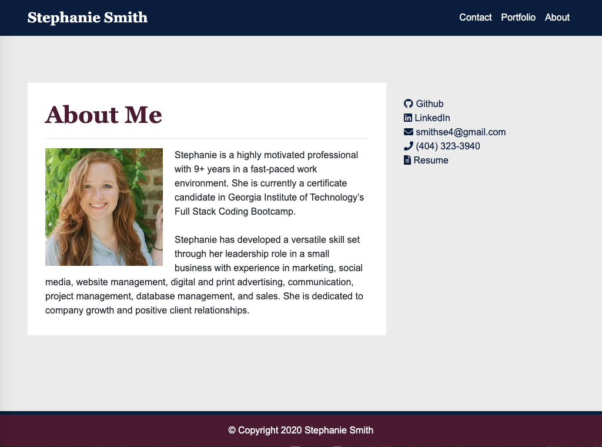
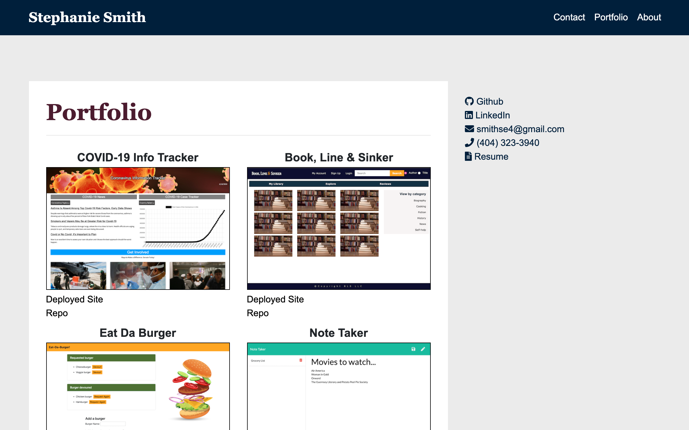
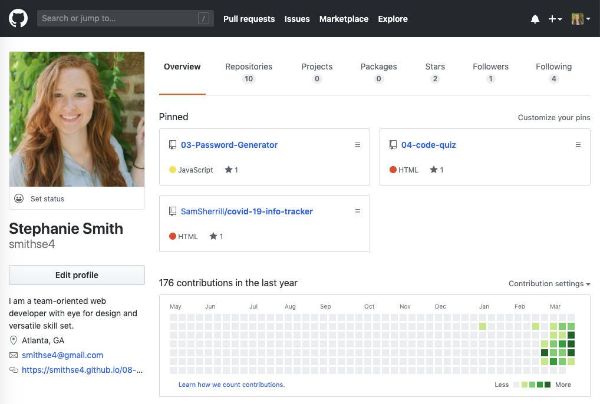
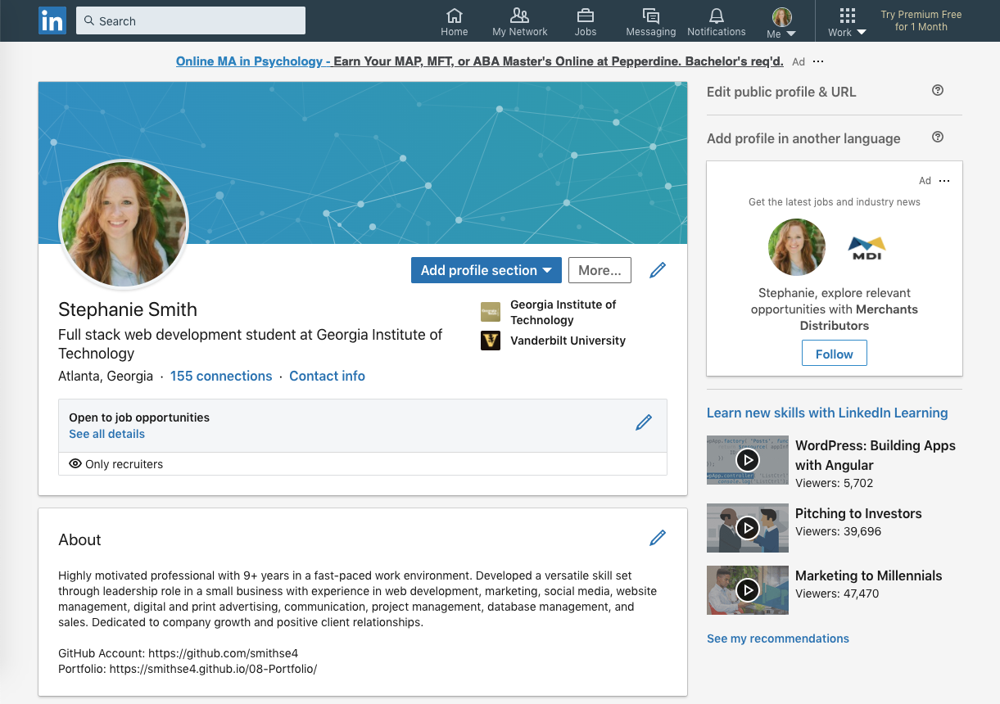

# Unit 08 Project 1 Homework: Professional Materials

## Description

Now that I have some practice with APIs and a project to share, I have updated my portfolio page and other materials to build toward being employer competitive.

## Links

Linked Github repository and deployed application for reference:

[Github repository](https://github.com/smithse4/08-Portfolio)

[Deployed application](https://smithse4.github.io/08-Portfolio/)

## Requirements

* Updated portfolio featuring project 1 and two exemplary homework assignments. 

* Update GitHub profile with pinned repositories featuring project 1 and two exemplary assignments. 

* Updated resume

* Updated LinkedIn profile

## Grading

| Requirement      | Weight |
|---               |---     |
| Portoflio        | 40%    |
| GitHub Profile   | 40%    |
| Resume           | 10%    |
| LinkedIn Profile | 10%    |

## Instructions

1. [Updated Portfolio](#updated-portfolio)
2. [GitHub Profile](#updated-github-profile)
3. [Updated Resume](#updated-resume)
4. [Updated LinkedIn](#updated-linkedin)

### Updated Portfolio

Your updated site should have the following content:

* Your name

* Links to your GitHub profile & LinkedIn page as well as your email address and phone number

* A link to a PDF of your resume

* A list of projects. For each project, make sure you have the following:

  * Project title

  * Link to the deployed version

  * Link to the GitHub repository

  * Screenshot of the deployed application

The image below shows the About Me page of my portfolio.

The image below shows the projects page of my portfolio.

#### Design

Unfortunately, this is where it gets a little bit subjective. Your site should look
"polished." Here are a few guidelines on what that means:

* Mobile-first design

* Choose a color palette for your site so it doesn't just look like
the default bootstrap theme or an unstyled HTML site.

* Make sure the font size is large enough to read, and that the colors don't cause eye strain.

### Updated GitHub Profile 

* If you haven't yet, now is the time to update the following in your GitHub profile: 

    * Profile picture

    * Bio

    * Location

    * Email

    * Link to your portfolio

* Employers (and potential collaborators) _will_ look at your GitHub profile, so put your best face forward. 

* Pin some repos that you want to highlight

  * Navigate to [GitHub](https://github.com/) and go to your profile.

  * Click "Customize your pins"

  * Click the checkboxes for your project and 2-3 homework assignments that you would like to share

  * Make sure each of these projects is deployed and add a link to the deployed project in their README files

* Follow your classmates. They are the beginning of your professional network and being a developer is as much about being a part of the community as it is writing code. 

The image below shows my updated GitHub profile.

### Updated Resume 

Submit a clear, concise and compelling resume, tailored to the type of job you’re looking for.

### Updated LinkedIn Profile 

Update your LinkedIn Profile with a strong bio statement, a professional photo, and links to your Github and portfolio.

The image below shows my updated LinkedIn profile.

